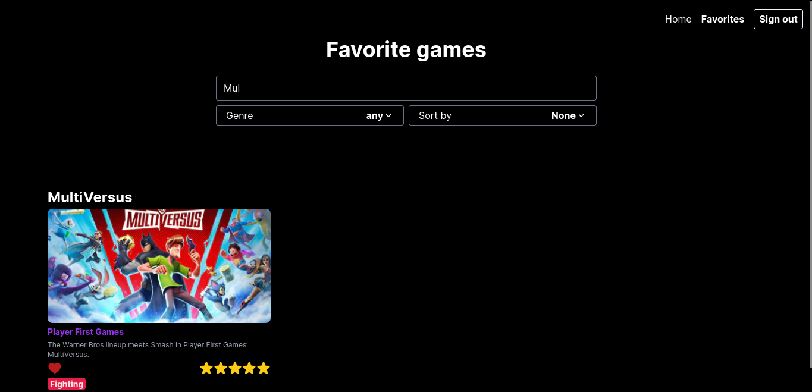

## Features

- Fetch data from api
- Show loader while data is loading
- Show games in 3 columns on desktop
- Responsive
- Show all information about the games
- Error handling
- Filter by genre
- Search by title
- 5 Seconds load timeout
- Authentication with email/password
- Save favorite games
- Rate games from 1 to 5 stars
- View the games without having to be authenticated
- Sort games by rating

## References

- https://firebase.google.com/docs/auth/admin/errors?hl=pt-br
- https://app-masters.notion.site/Projeto-de-Est-gio-Frontend-React-34d8dcade9f74da29e5e1d4f0d6ef737
- https://app-masters.notion.site/Projeto-de-Est-gio-Frontend-React-Segunda-etapa-92adfabbc90749ac8c41b28e33609a38
